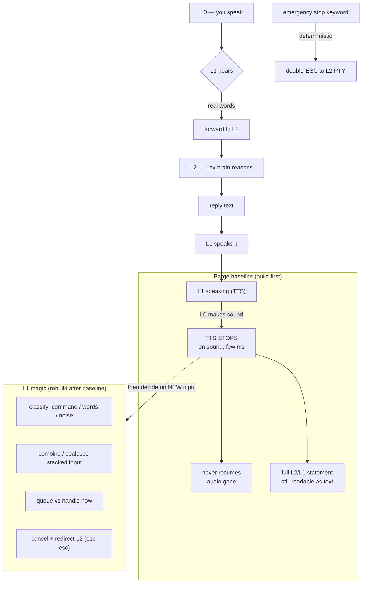

# Layer 1 Control — the voice control layer (single source of truth)

Combines and supersedes the voice-layer design scattered across
`VOICE-TOP-LAYER-SPEC.md` (interrupt semantics), `VOICE-TOP-LAYER-SMARTS-SPEC.md`
(P0-P5 smarts), `VOICE-BARGE-CLASSIFIER-SPEC.md` (buckets), and
`COALESCE-UTTERANCE-QUEUE.md` (queue/combine/cancel). Those stay as history;
this is the doc to build to.

Written 2026-07-20 on operator direction: strip the broken "smart barge" that
produces empty (`chars=0`) top-layer turns, land a deterministic barge baseline,
then rebuild the L1 intelligence on top of that baseline.

---

## The three layers (operator's words)

- **Layer 0 — you.** You speak. Nothing else.
- **Layer 1 — control / voice.** Owns speaking (TTS). Hears L0. Follows the
  rules in its per-turn system prompt (is this a command, real words, or
  background noise). Routes real substance down to L2, speaks L2's answers back
  up. Owns everything that happens on a barge: stop, then combine / queue /
  cancel / redirect.
- **Layer 2 — brain.** Lex (opus). Reasons, supervises workers (L3). Never
  speaks or hears directly. Words go down, results come back up.

L1 is the ONLY layer that touches audio.

---

## Normal turn (no barge)

```
L0 speaks ──▶ L1 hears ──▶ L1 rules: command | words | noise
                              │
                     (real words) ──▶ forward to L2
                              │
                     L2 reasons ──▶ reply text ──▶ L1 speaks it (TTS)
```

If you stay quiet, L2's reply plays in full.

---

## Barge — THE BASELINE (this doc's first deliverable)

The rule is deterministic and dumb on purpose. No model decides whether to stop.

```
L1 is speaking (TTS playing)
         │
   L0 makes any sound  ──▶  TTS STOPS immediately (a few ms, on sound, not on transcript)
         │
   Playback NEVER resumes.  The interrupted audio is gone.
         │
   BUT: the full L2/L1 statement still exists as TEXT in the transcript.
        Only the audio output was cut. You can read the whole thing.
```

Acceptance (the baseline test, operator-defined):

1. While L1 is speaking, make a sound. TTS stops.
2. It never resumes. No "pause then continue."
3. The complete statement from L2 (and L1's own line) is still readable in the
   transcript. Only the spoken audio was interrupted; the text is intact.

Everything else in this doc is built ON this baseline. If this is not rock
solid, nothing above it can be trusted.

### What got torn out to reach the baseline (SHIPPED 2026-07-20)

- **The word-gate is gone.** A VAD onset during playback now FIRES the stop
  immediately (`barge-word-gate.ts`): any noise over the floor cuts the audio,
  no wait for the transcriber. Was: VAD armed, 2 interim non-echo words fired.
- **The resume mechanism.** `resumeBargedSpeech()` is deleted; every barge path
  calls `dropBargeStash()` (drop the stash, stay stopped). A barge never resumes.
- **No L2 truncation on an ordinary barge.** `confirmRealBarge(false)` on the
  forward path: L2 finishes its reply and the full statement stays readable as
  text. Only the deterministic emergency stop (panic -> double-ESC) truncates L2.
- **The whole smart L1 ask is DELETED, not gated.** `topLayerTurn`,
  `parseTopLayerReply`, `applyTopLayerControl`, the classify/rethink/finish
  helpers, and ~80 tests are gone. `runTopLayerVoiceTurnOnce` forwards the
  operator utterance straight to L2.
- **The `chars=0` top-layer ask on the conversational path.** The haiku L1 ask
  returned an empty turn every time and fail-safe-forwarded the operator's words
  verbatim to L2 anyway, at a 4-13s latency cost. On the baseline, the operator
  utterance forwards straight to L2. No empty ask, no latency, no `chars=0`.

Torn out, not patched. The L1 intelligence is rebuilt deliberately (next), not
resurrected from the broken shape.

---

## After the baseline — L1 does the magic (rebuilt on top, later)

Once barge is deterministic and L2 text always flows, L1's per-turn system
prompt gets built out to decide, on each barge, what happens to the new input:

- **Combine / coalesce** — stacked utterances mid-reply merge into ONE handling,
  no double-answer (from `COALESCE-UTTERANCE-QUEUE` point 5 + SMARTS P3).
- **Queue vs handle now** — decide whether the new input waits for the current
  L2 turn to finish or interrupts it.
- **Cancel + redirect L2** — a countermand drops L2's in-flight work
  (double-ESC `\x1b\x1b` to the L2 PTY) and sends the new direction. Latest
  wins (`COALESCE` contradiction case).
- **Classify** — command vs real words vs background noise, per-turn
  system-prompt rules (buckets from `VOICE-BARGE-CLASSIFIER-SPEC` §3).
- **Emergency stop** stays deterministic and hard-wired (panic keyword →
  `\x1b\x1b`), never model-dependent.

None of this resumes cut audio. Stop is always final. The magic is about what to
do with the NEW input, not about putting the old audio back.

---

## Flow diagram



---

## Code map (where this lives)

- Daemon L1/barge: `07-daemon/src/voice/lex-voice-ws.ts`
  - `resumeBargedSpeech` ~3508, `confirmRealBarge` ~3531, `killActiveTts` ~3548
  - `runTopLayerVoiceTurnOnce` ~4600 (the smart ask + rethink/finish, ~4662-4714)
  - transcript/barge dispatch ~4240-4420
- L1 ask (the `chars=0` source): `07-daemon/src/lex/voice-brain-session.ts` `askVoice` ~790, log ~863
- L1 prompt: `07-daemon/src/voice/voice-top-layer.ts` (`topLayerSystem`, `topLayerPrompt`)
- Client audio + barge trigger: `08-dashboard/components/VoiceClient.tsx`;
  word-gate reducer `07-daemon/src/voice/engine/barge-word-gate.ts`
- Deterministic buckets (built, not yet wired): `07-daemon/src/voice/engine/barge-classifier.ts`
- Coalesce module: `07-daemon/src/voice/lex-voice-coalesce.ts`
